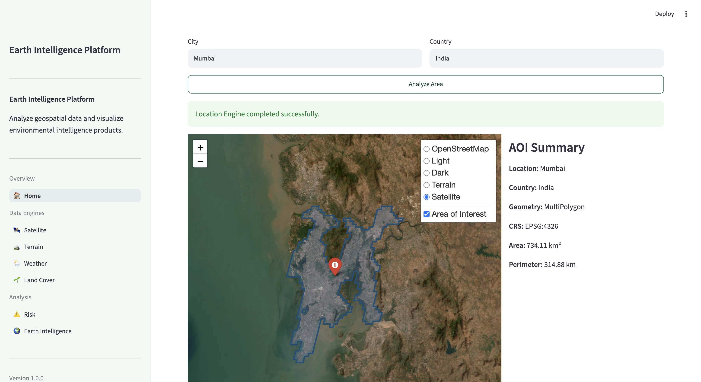
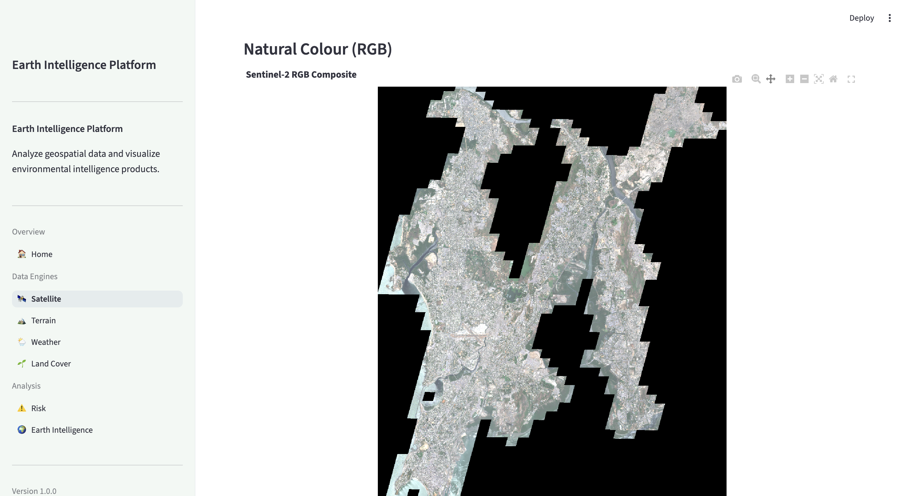
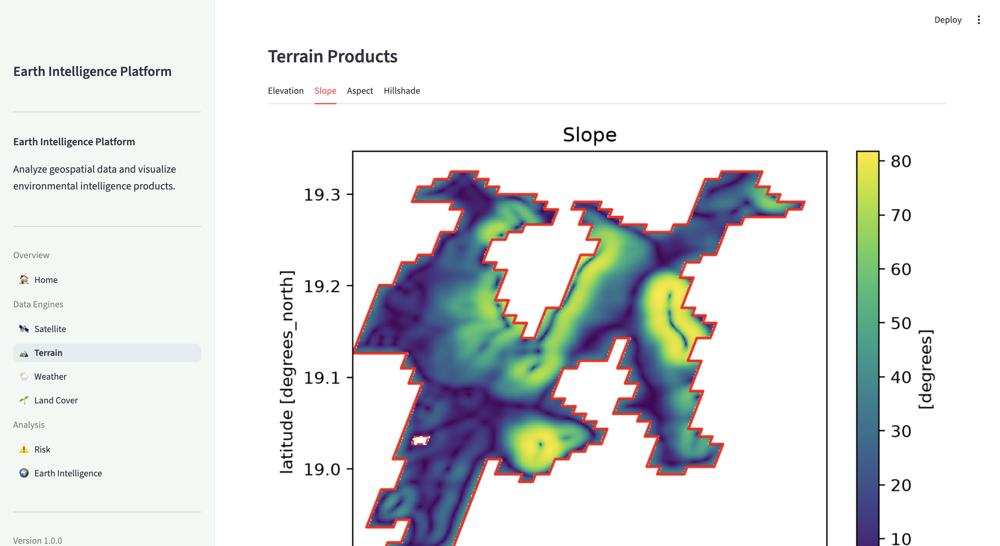
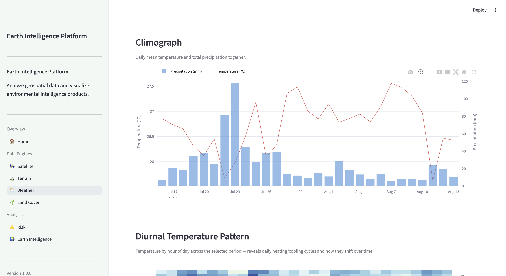
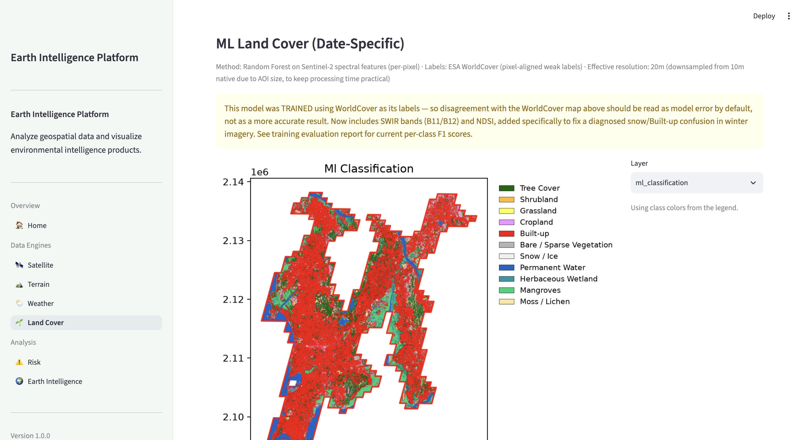
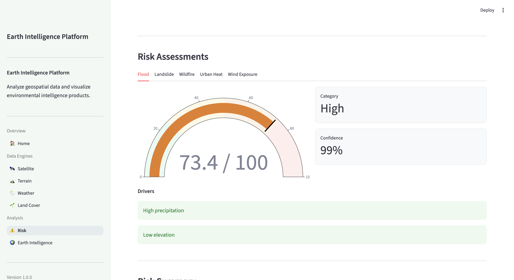
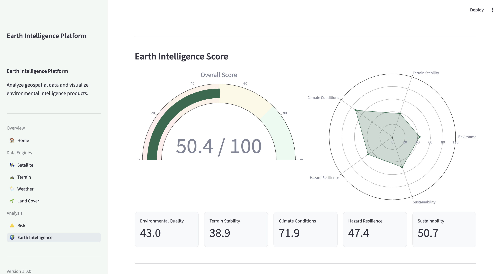
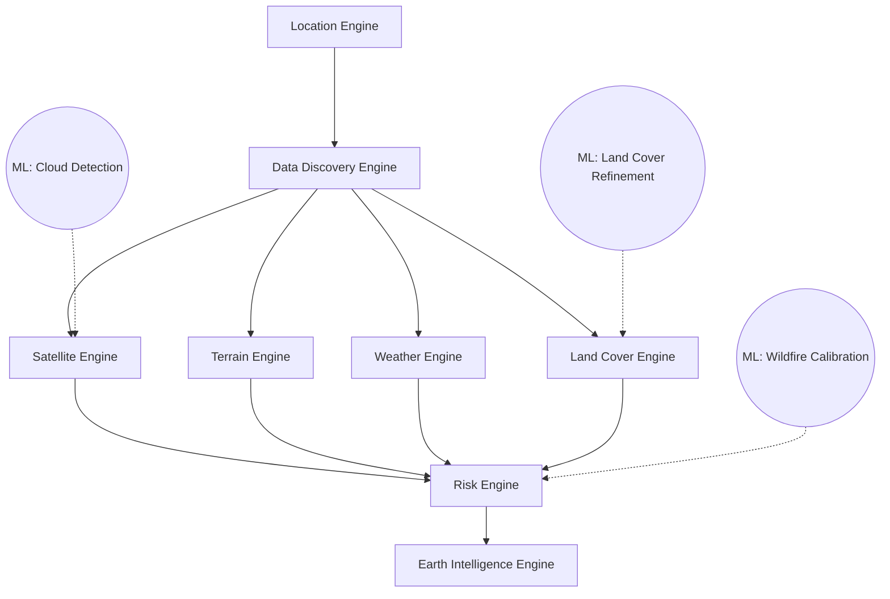

# Earth Intelligence Platform

<p align="center">


</p>

An integrated GeoAI platform for Earth observation and environmental
intelligence, built in Python with Streamlit, pystac-client, odc-stac,
xarray, rioxarray, GeoPandas, and the Microsoft Planetary Computer.

The platform combines eight modular engines — Location, Satellite,
Terrain, Weather, Land Cover, Risk, and Earth Intelligence — into a
single pipeline that takes a place name and produces an integrated
environmental risk assessment, with three custom-trained machine
learning models woven into the pipeline alongside deterministic
geospatial analysis.

## Table of Contents

- [Live Demo](#live-demo)
- [Screenshots](#screenshots)
- [Architecture](#architecture)
- [Machine Learning Components](#machine-learning-components)
- [Known Limitations](#known-limitations)
- [Development History](#development-history)
- [Setup](#setup)
- [How to Use](#how-to-use)
- [Skills Demonstrated](#skills-demonstrated)
- [Citation](#citation)
- [Acknowledgements](#acknowledgements)
- [Author](#author)

## Live Demo

[**Try it live →**](https://earthintelligenceplatform-upeeswbrd44n7xgbtcwazt.streamlit.app/)

> **Note:** Free-tier hosting has limited memory (~1GB RAM). Smaller AOIs (e.g.
> Mumbai) run reliably; very large metropolitan AOIs (e.g. Tokyo) may
> be slow or hit resource limits. The Land Cover ML classification
> model (~1.4GB) is excluded from this deployment for the same reason
> — WorldCover still works fully; the ML comparison layer is available
> when running locally. See [Known Limitations](#known-limitations)
> and [Setup](#setup) for the complete experience.
>

## Screenshots

<p align="center">

</p>

<p align="center">
<b>Figure 1.</b> Home — Location Selection & AOI.
</p>

<p align="center">

</p>

<p align="center">
<b>Figure 2.</b> Satellite Engine — Multi-Tile Acquisition, RGB Composite.
</p>

<p align="center">

</p>

<p align="center">
<b>Figure 3.</b> Terrain Engine — Slope Distribution.
</p>

<p align="center">

</p>

<p align="center">
<b>Figure 4.</b> Weather Engine — Climograph.
</p>

<p align="center">

</p>

<p align="center">
<b>Figure 5.</b> Land Cover — Classification with Legend.
</p>

<p align="center">

</p>

<p align="center">
<b>Figure 6.</b> Risk Engine — Multi-Hazard Assessment.
</p>

<p align="center">

</p>

<p align="center">
<b>Figure 7.</b> Earth Intelligence Engine — Synthesized Earth Intelligence Score.
</p>

## Architecture



Each engine returns a standardized product object, cached in Streamlit
session state, so downstream engines and pages can consume upstream
results without recomputation.

### The core technical fix: acquisition-based tile selection

The Satellite Engine's original design selected a single Sentinel-2
STAC item per request. For AOIs spanning multiple MGRS tiles (which
includes most real cities), this silently produced imagery that was
~99.85% NaN outside a single tile's footprint — a black-looking image
that ran without errors.

The fix reframes tile selection around **acquisitions**: groups of
same-date STAC items whose combined footprint is evaluated against the
AOI as a whole. `group_acquisitions.py` computes real geometric
coverage percentage and a coverage-weighted cloud score per
acquisition; `select_acquisition.py` enforces a minimum coverage gate
before proceeding; `load_imagery.py` mosaics every tile belonging to
the selected acquisition via `odc.stac.load(groupby="solar_day")`.

## Machine Learning Components

Three components are genuinely trained models, not hand-tuned
heuristics — each is disclosed honestly, including known weaknesses.

| Component | Method | Training Data | Validation |
|---|---|---|---|
| **Cloud Detection** | Random Forest on spectral bands + indices | 6 diverse Sentinel-2 scenes, labeled via Sentinel-2's own Scene Classification Layer | Trained/evaluated end-to-end |
| **Land Cover Refinement** | Random Forest on spectral + texture + SWIR/NDSI features (16 features) | 14 globally diverse sites, ESA WorldCover as weak labels, stratified per-class sampling | Macro F1 **0.60** across 11 classes |
| **Wildfire Risk Calibration** | Random Forest on weather + vegetation covariates | Real NASA FIRMS fire detections vs. sampled background points, 5 countries | 82% accuracy, 0.81 macro F1 (pilot scale, ~830 points) |

The other four hazards (Flood, Landslide, Urban Heat, Wind Exposure)
use deterministic, hand-weighted formulas — disclosed as such, not
presented as learned models.

### Case study: diagnosing and fixing a real model failure

While testing the Land Cover ML classifier on Aomori, Japan (winter
imagery), snow cover was almost entirely misclassified as Built-up.
Root cause: the original 13-feature set had no shortwave-infrared
(SWIR) bands, which is specifically what separates snow from other
bright surfaces in real remote sensing practice — without it, snow and
concrete/rooftops are spectrally similar enough to confuse a simple
classifier.

Fix: added Sentinel-2 bands B11/B12 and NDSI (Normalized Difference
Snow Index) to the feature set, updated `load_imagery.py`,
`landcover_features.py`, and retrained. Result: macro F1 improved from
0.55 → 0.60, Snow/Ice F1 from 0.40 → 0.48, and Built-up precision from
0.53 → 0.56 — confirming the diagnosed mechanism was correct, not just
a guess.

## Known Limitations

Documented honestly rather than hidden, consistent with the project's
overall approach:

- **Landslide, Flood, Wind, Urban Heat risk calibration**: not
  ML-calibrated (unlike Wildfire). Landslide and Wind had tractable
  public event datasets identified (NASA COOLR, IBTrACS) but data
  access issues prevented completion within the project timeline.
  Flood and Urban Heat have no comparable discrete-event public
  dataset available.
- **Terrain slope artifacts**: Copernicus DEM is a Digital Surface
  Model (includes building heights, not bare earth), producing
  inflated slope values in dense urban areas. Mitigated via coarser
  DEM resolution (90m) and Gaussian smoothing, plus switching
  Landslide's slope aggregation from AOI-wide mean to
  percentage-of-area-exceeding-threshold (more consistent with
  real landslide susceptibility literature) — but not fully
  eliminated; flagged as an open question in ongoing risk-score
  investigation for dense cities.
- **Temporal change detection**: architecturally scoped (two Satellite
  Engine runs on pixel-aligned deterministic grids would enable direct
  before/after comparison) but not built.
- **All ML models are pilot-scale**: trained on tens to low thousands
  of samples, not production-scale datasets. Validation is
  train/test split, not independent held-out ground truth.
- **Land Cover ML classification**: trained using ESA WorldCover as
  weak labels, meaning it cannot exceed WorldCover's own accuracy by
  design — its value is date-specificity (reflecting the actual
  selected acquisition date, not WorldCover's fixed vintage), not
  raw accuracy improvement.
- **Processing time scales with AOI size**: large metropolitan areas
  (e.g. Tokyo, ~127M pixels) take substantially longer than smaller
  AOIs (e.g. Mumbai, ~18M pixels) due to proportionally more satellite
  data being downloaded and processed. Land Cover's ML classification
  adaptively downsamples large AOIs to keep runtime practical,
  disclosed via effective resolution in the UI.
- **Wildfire risk model temporal window**: trained on 7-day
  pre-fire weather windows; at runtime, uses whatever date range was
  selected in the Weather Engine, which may not match — disclosed via
  an in-app caveat.

## Development History

This platform began as a series of sequential prototyping notebooks
(`notebooks/`) — one per engine, run manually and chained via JSON/
NetCDF file exports. It was then rebuilt into the current modular,
multi-page Streamlit platform with proper engine separation, session
state management, and cross-engine dependencies. Several early design
decisions (and bugs, including the original Terrain DEM clipping
issue) trace directly back to the notebook prototypes.

## Setup

```bash
pip install -r requirements.txt
python3 -m streamlit run earth_intelligence_platform/app.py
```

To retrain any of the three ML models (optional — trained models are
already committed):

```bash
python earth_intelligence_platform/models/train_cloud_classifier.py
python earth_intelligence_platform/models/train_landcover_classifier.py
python earth_intelligence_platform/models/train_wildfire_risk_classifier.py
```

## How to Use

1. **Home** — Enter a city and country (e.g. "Mumbai", "India"), click
   **Analyze Area**. This runs the Location Engine and Data Discovery
   Engine, resolving the city to a real administrative boundary and
   building a dataset catalog.

2. **Satellite** — Set a date range and maximum cloud cover threshold,
   click **Run Satellite Engine**. Searches Sentinel-2 imagery,
   selects the best-covering multi-tile acquisition, and produces RGB,
   False Colour, and ML-detected cloud mask visualizations.

3. **Terrain** — Click **Run Terrain Engine**. Downloads a Copernicus
   DEM and derives elevation, slope, aspect, and hillshade.

4. **Weather** — Set a historical date range, click **Run Weather
   Engine**. Fetches hourly weather data and computes extremes, daily
   trends, and a historical baseline comparison.

5. **Land Cover** — Click **Run Land Cover Engine** (run Satellite
   first to also get the date-specific ML classification alongside
   the static ESA WorldCover baseline).

6. **Risk** — Requires Terrain, Land Cover, Weather, and Satellite to
   have all run first. Click **Run Risk Engine** for a 5-hazard
   assessment (Flood, Landslide, Wildfire, Urban Heat, Wind), with a
   learned ML comparison score for Wildfire specifically.

7. **Earth Intelligence** — Requires all six engines above. Click
   **Run Earth Intelligence Engine** for a single synthesized score
   combining environmental quality, terrain stability, climate
   conditions, hazard resilience, and sustainability.

Each engine's page includes an **Advanced Information** and
**Developer Debug** expander showing the full underlying data, for
anyone wanting to inspect intermediate values.

## Skills Demonstrated

- Earth Observation & Satellite Remote Sensing (Sentinel-2, Copernicus DEM)
- STAC-based Geospatial Data Discovery (pystac-client, odc-stac)
- Multi-Engine Pipeline Architecture & Session State Management
- Machine Learning (Random Forest classification/calibration, scikit-learn)
- Feature Engineering for Remote Sensing (spectral indices, SWIR, NDSI, texture)
- Model Diagnosis & Root-Cause Analysis (Aomori snow/Built-up case study)
- Geospatial Data Processing (GeoPandas, rioxarray, xarray, rasterio)
- Multi-Hazard Risk Modeling & Susceptibility Analysis
- Data Visualization (Plotly, Matplotlib)
- Cloud Deployment & Dependency Management (Streamlit Community Cloud, Git LFS)

## Tech Stack

Streamlit · pystac-client · odc-stac · xarray · rioxarray · GeoPandas ·
scikit-learn · Plotly · Microsoft Planetary Computer · ESA WorldCover ·
Open-Meteo · NASA FIRMS

## Citation

If you reference this project, please cite it as:

```text
Jariwala, S. (2026).

Earth Intelligence Platform: An Integrated GeoAI System for
Environmental Risk Assessment.

GitHub Repository:
https://github.com/ShreyaJari/Earth_Intelligence_Platform
```

## Acknowledgements

This project uses open datasets and open-source software from:

- Microsoft Planetary Computer
- ESA WorldCover
- Copernicus DEM
- Sentinel-2 (Copernicus Programme)
- Open-Meteo
- NASA FIRMS
- Streamlit, scikit-learn, GeoPandas, xarray, rioxarray

## Author

**Shreya Jariwala**

This repository was developed as part of my GeoAI portfolio,
demonstrating an integrated pipeline combining Earth Observation,
geospatial analytics, and machine learning for environmental
intelligence.

**Connect with me**

- LinkedIn: *(https://www.linkedin.com/in/shreya-jariwala-61681a171/)*
- GitHub: https://github.com/ShreyaJari

## License

This project is licensed under the **MIT License**. See the `LICENSE`
file for additional details.

---

## If you found this project useful, consider giving the repository a star!

Feedback, suggestions, and contributions are always welcome.
